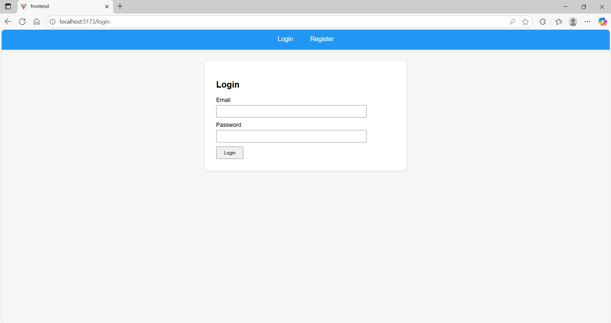
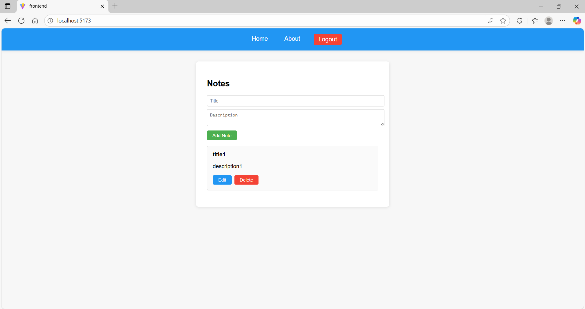
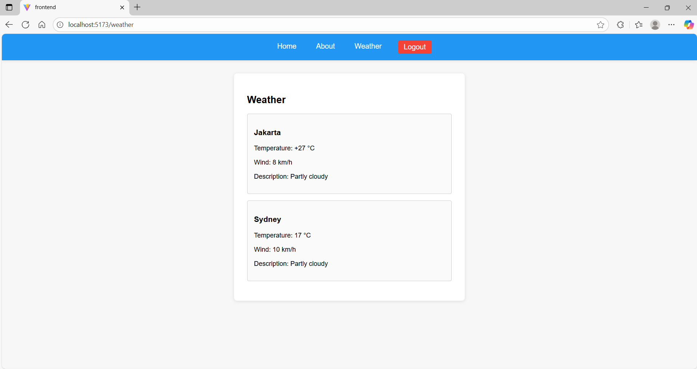

# Web-Project
Web-Project is a learning and practice repository about web.

## Project Structure
- **backend/**: Backend source code
- **frontend/**: Frontend source code
- **docs/**: Documentation

## Features
- Authentication

- Notes

- Weather


## Technologies Used
- Backend: Node.js (Express.js) and MongoDB
- Frontend: React

## Getting Started
- Backend
```bash
cd backend
npm init -y
npm install express nodemon mongoose dotenv cors bcryptjs jsonwebtoken
```
- Frontend
```bash
cd frontend
npm create vite@latest .
npm install
npm install react-router-dom
```

## Usage
- Run backend by "nodemon server.js"
- Run frontend by "npm run dev"

## Contributing
Feel free to fork this repository and submit pull requests for improvements or new features.

## Contact
Created by frozin01 (helped by GPT). For questions, open an issue or contact via GitHub.